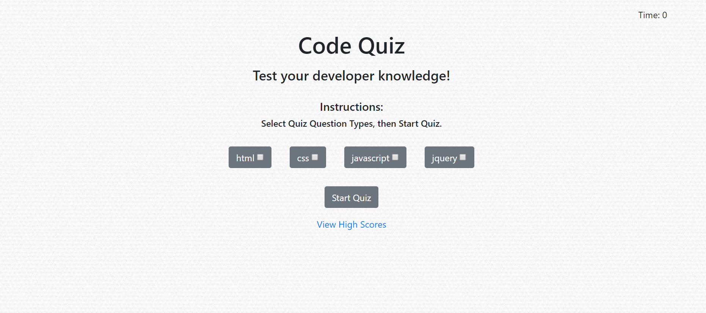

# Code-Quiz
Assess your coding skills and progression with a code quiz.

<a href="https://kshep425.github.io/Code-Quiz/" target="_blank">
Code Quiz
    

        
    

</a>

## Description
This quiz will assess your coding knowledge of css, html, javascript, and jquery.  We utilize common interview questions to help you prep for interviews and tests.

Answer 5 questions as quickly as possible to enter your name on the leaderboard.  Your score is the time left.  If you answer a question wrong 5 seconds is subtracting from the time left reducing your high score.  You want your score to be as close to 60 seconds as possible!

Don't run out of time! You lose if 60 seconds passes.

In addtion, this tool was created to test my javascript skills, all html elements were created and added using javascript.  The pages were styled using bootstrap.

## Usage
<a href="./assets/audioVisual/CodeQuiz.webm">Watch usage video</a>

### Quiz Question Types
There are four quiz question options covering coding topics:

1. HTML
1. CSS
1. Javascript
1. JQuery

Selecting quiz types will allow you to filter questions to different coding topics.  If no options are selected, it defaults to all four question types.

### Start Quiz
To start the quiz, select the start quiz button. Then the timer will start the countdown from 60 seconds and you can select answers on the page.

### Quiz complete
The game ends when you either:
1.  Answer 5 questions or
1.  Run out of time

The score is the time left on the clock minus 5 seconds for every answer answered incorrectly.

Enter your name to submit your score and be added to the High Scores board.

### High Scores Board
Find out how well you did compared to others by looking at the high scores.

From here, you can clear the high scores table, or play again.

Pressing Play Again will start the quiz again with the same question types selected before.

## Credits

* [Bootstrap4](https://www.getbootstrap.com)
* [Subtle Pattern](https://www.subtlepatterns.com)
* [Shuffle](https://www.w3resource.com/javascript-exercises/javascript-array-exercise-17.php)
* [javaTpoint Interview Questions and Answers](https://www.javatpoint.com/interview-questions-and-answers)
* [W3Schools](https://www.w3schools.com)
* [Amazon Prime Music](https://music.amazon.com)

## License
MIT License

Copyright (c) 2019 kshep425

Permission is hereby granted, free of charge, to any person obtaining a copy
of this software and associated documentation files (the "Software"), to deal
in the Software without restriction, including without limitation the rights
to use, copy, modify, merge, publish, distribute, sublicense, and/or sell
copies of the Software, and to permit persons to whom the Software is
furnished to do so, subject to the following conditions:

The above copyright notice and this permission notice shall be included in all
copies or substantial portions of the Software.

THE SOFTWARE IS PROVIDED "AS IS", WITHOUT WARRANTY OF ANY KIND, EXPRESS OR
IMPLIED, INCLUDING BUT NOT LIMITED TO THE WARRANTIES OF MERCHANTABILITY,
FITNESS FOR A PARTICULAR PURPOSE AND NONINFRINGEMENT. IN NO EVENT SHALL THE
AUTHORS OR COPYRIGHT HOLDERS BE LIABLE FOR ANY CLAIM, DAMAGES OR OTHER
LIABILITY, WHETHER IN AN ACTION OF CONTRACT, TORT OR OTHERWISE, ARISING FROM,
OUT OF OR IN CONNECTION WITH THE SOFTWARE OR THE USE OR OTHER DEALINGS IN THE
SOFTWARE.

## Badges
N/A

## Contributing
N/A

## Tests
N/A